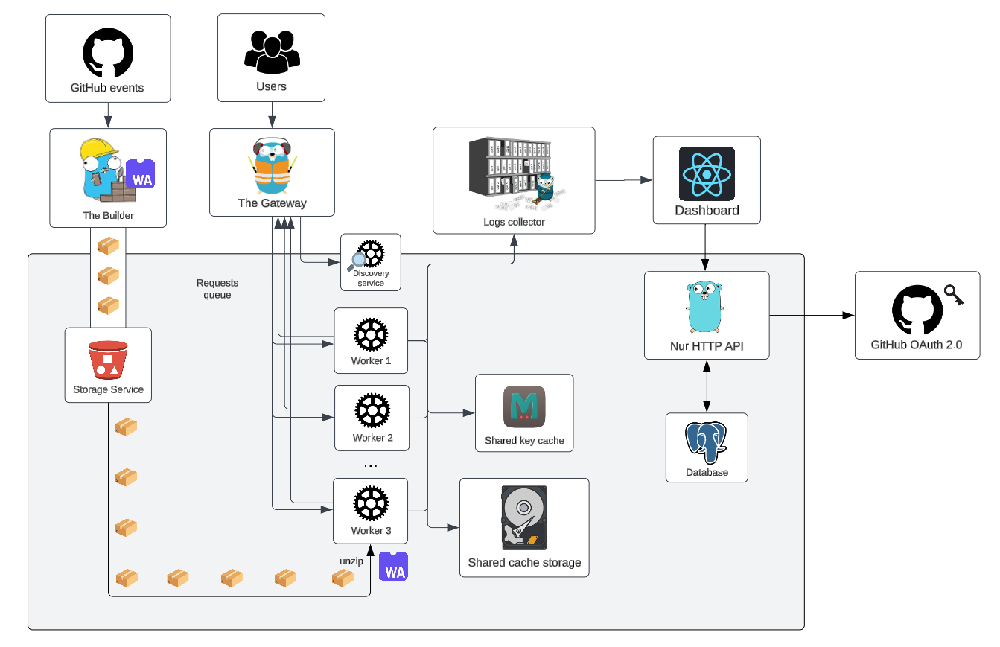

<h1 align="center">
The Nur platform
</h1>

<p align="center">
    The serverless platform to build and run WASM-based lambda functions
</p>

<p align="center">
<a href="https://github.com/fisirc/nur/blob/main/LICENSE">
    
</a>
</p>

The following is a diagram of the complete Nur architecture. The components are hosted in
different repositories



- Nur builder - <https://github.com/fisirc/nur-builder>

  Responsible of compiling the high level code written in languages that
  support WASM as compile target, such as Rust, Go, C++, Zig or WAT directly.

- Nur gateway - <https://github.com/fisirc/nur-gateway>

  Receives function execution requests to be executed by a worker pool.
  It has streaming capabilities to not only support HTTP, but also TCP.

- Nur worker - <https://github.com/fisirc/nur-worker>

  Runs the actual lambda executions. It embeds Wasmer as a WASM runtime that
  also pre-compiles the binary to native instructions to mitigate cold starts.
  It is highly paralelized and designed to be replicated and scale horizontally.

- Nur web platform - <https://github.com/fisirc/nur-web-app>

  The Nur platform to manage your lambda functions, endpoints and HTTP methods.
  It also embeds a REST client to test and debug your functions.

- Nur IaC infrastructure - <https://github.com/fisirc/nur-infra>

  Deploy Nur infrastructure in AWS with Terraform

---

## Writing your own WASM function

Nur implements three builtin functions (intrinsics) that you can use in your code, such as:

- `nur_send` to write to the TCP stream
- `nur_log` for debugging logs that won't be sent to the user
- `nur_end` to close the TCP stream

And there are two symbols you need to export:

- `poll_stream`, called for each TCP chunk of data that is streamed from the client.
- `alloc`, to allocate dynamic memory for your program needs

This is an example of an echo server lambda written in Rust:

```rs
// Define a function that is imported into the module.
// By default, the "env" namespace is used.

mod import {
    #[link(wasm_import_module = "nur")]
    unsafe extern "C" {
        pub fn nur_send(ptr: *const u8, len: usize);
        pub fn nur_log(ptr: *const u8, len: usize);
        pub fn nur_end();
    }
}

fn nur_log(msg: &str) {
    unsafe {
        import::nur_log(msg.as_ptr(), msg.len());
    }
}

fn nur_send(msg: &[u8]) {
    unsafe {
        import::nur_send(msg.as_ptr(), msg.len());
    }
}

// Abort doesn't really do something special, it just sends the signal to the host to end
// its lifecycle
fn nur_end() {
    unsafe {
        import::nur_end();
    }
}

// This will be called by wasmer
#[unsafe(no_mangle)]
pub extern "C" fn poll_stream(data: usize, len: usize) {
    let data: *const u8 = data as *const u8;
    let slice = unsafe { std::slice::from_raw_parts(data, len) };

    let content = match str::from_utf8(slice) {
        Ok(content) => content,
        Err(e) => {
            nur_log(e.to_string().as_str());
            return nur_end();
        }
    };
    let content_len = content.len();

    nur_log(format!("Receiving a TCP chunk of size {}", content_len));

    nur_send(
        format!(
            "HTTP/1.1 200 OK\r
content-length: {content_len}\r
\r
{content}",
        )
        .as_bytes(),
    );
    nur_end();
}

#[unsafe(no_mangle)]
pub extern "C" fn alloc(len: usize) -> usize {
    let layout = std::alloc::Layout::array::<u8>(len).unwrap();
    unsafe { std::alloc::alloc(layout) as usize }
}
```

## Testing

```sh
cd worker/

cargo test
```

## Running with logs enabled

```sh
cd worker/

RUST_LOG=none,nur_worker=trace cargo run
```
